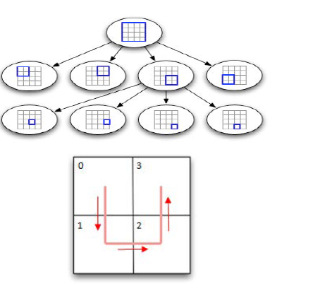

# Borrador DNMIE – Construcción de PSU para el Nuevo Marco de Referencia de Muestreo

En esta nota se comentan primera y brevemente los diversos métodos empleados 
para el armado de PSU para el nuevo marco, junto con sus ventajas y desventajas. 
Luego se muestra una aplicación sobre los radios del Censo 2010 de la localidad de Rosario.

## MaxP

### Duque, J. C., Anselin, L., & Rey, S. J. (2012). 
The max‐p‐regions problem.

El método “max p” busca el número máximo de regiones que maximizan 
la homogeneidad en variables objetivo, respetando un tamaño mínimo 
de las regiones fijado como parámetro. 
Tiene la ventaja de que el número de regiones es calculado por el algoritmo, 
garantiza contigüidad y respeta un tamaño mínimo de las regiones. 
Tiene las desventajas de que no se puede fijar un tamaño máximo de las regiones 
y de que busca crear regiones homogéneas cuando nuestro objetivo es 
crear regiones heterogéneas

## Programa lineal

### Hess, S. W., Weaver, J. B., Siegfeldt, H. J., Whelan, J. N., & Zitlau, P. A. (1965). Nonpartisan political redistricting by computer. 

El método de “distritos iguales” busca dividir distritos en K regiones, 
tratando de que éstas sean lo más compactas posible. Se basa en un programa lineal 
que intenta minimizar la compacidad de las regiones, de tal forma que respeten 
límites de tamaño preestablecidos. 
Tiene la ventaja de respetar los límites poblacionales fijados, 
pero no garantiza contigüidad de las regiones formadas y 
requiere del número de regiones a crear como parámetro.

Una variante utilizada para crear clusters fue una combinación de “max-p” 
con el algoritmo de “distritos iguales” (UltraClusters). 
Se le pidió al maxp que homogeneizara solo la variable de tamaño (viviendas habitadas) y 
un tamaño mínimo de regiones igual al tamaño objetivo. 
Los clusters “grandes” resultantes de max-p (de aproximadamente el doble del tamaño objetivo) 
fueron entregados al programa lineal para que los rompiera en dos mitades de tamaño similar. 
La salida de este método entonces son los clusters formados por max p y 
los clusters de maxp que pasaron por el programa lineal, 
lo que mejora la uniformidad del tamaño de estos últimos, 
pero rompe la contigüidad brindada por el maxpl.

## Hill Climbing

### Drew, J. D., Belanger, Y., & Foy, P. (1985). Stratification of the Canadian Labour Force Survey. 

El método de “Hill Climbing” de Friedman y Rubin es un algoritmo que busca 
formar clusters maximizando una medida de heterogeneidad intra-cluster 
(suma de cuadrados intra-cluster) mediante un algoritmo “greedy”: 
dada una asignación de clusters a los radios, se recorre todos los radios y 
se intenta, para cada radio cambiar su cluster a otro de tal forma de 
obtener el máximo aumento en la heterogeneidad global. 
El algoritmo se detiene cuando no hay ningún cambio de cluster para ningún radio 
que mejore la medida de heterogeneidad. 
Este algoritmo tiene la ventaja de que intenta maximizar 
la heterogeneidad intra-cluster, pero las desventajas de 
que deben incorporarse explícitamente las restricciones de continuidad y tamaño 
(solo puede brindarse un proxy con la condición de compacticidad) y 
el algoritmo es muy dependiente de la asignación de clusters inicial.
La suma de cuadrados intracluster que utiliza el método “hill climbing” 
es la suma de cuadrados de muestreo PPS, 
ver [fórmulas](https://gitlab.indec.gob.ar/halperin/dniem-psu/blob/master/formulas%20hill%20climbing.md).

La variante ensayada para armar clusters de radios 
fue utilizar el algoritmo “Hill Climbing” con restricciones de 
tamaño, contigüidad y compacticidad para mejorar la heterogeneidad de los clusters 
resultantes de los métodos de Elliot (**EHill**) y de MaxP + programa lineal (**MaxHill**). 
Se eligieron estos métodos como inicio del “Hill Climbing” 
porque forman relativamente pocos clusters discontinuos.

## Método de Elliot

### Elliott, M. R. (2011). A simple method to generate equal-sized homogenous strata or clusters for population-based sampling. 

El algoritmo parte de un radio inicial elegido por aleatoriamente, 
y se asigna al primer cluster. 
Se añaden radios vecinos del radio inicial, seleccionados al azar, 
hasta que se alcance el mínimo de número de viviendas deseadas en el cluster o 
hasta que todos los radios vecinos hayan sido añadidos. 
Si el radio inicial se queda sin vecinos se añaden los radios más cercanos, 
tomando como medida de cercanía la distancia de los centroides de cada radio al radio inicial.
Una vez que el cluster llega al tamaño mínimo de viviendas, 
se selecciona un nuevo radio inicial y se reitera el proceso de selección de radios 
entre los disponibles. 
Un radio no puede pertenecer a más de un cluster.
La creación de clusters continúa hasta que no haya más radios disponibles o 
hasta que los radios restantes no puedan cumplir el requerimiento para conformar un nuevo cluster.
Este proceso se itera $`n`$ = 300 veces, es decir, 
se obtienen $`n`$ configuraciones de clustering 
(notar que el número de clusters puede variar en cada iteración, pues no es conocido a priori). 

Para cada una (iteración?) se calcula la suma de cuadrados intraclase, definida como

```math
SCW = \sum_{k=1}^L \frac{x_{\cdot\cdot}}{x_{\cdot k}}
      \sum_{j=1}^{N_k} \frac{x_{jk}}{x_{\cdot k}}
      \left( \frac{x_{\cdot k}}{x_{jk}} y_{jk} - y_{i\cdot k} \right)^2
```

donde 
$`L`$, la cantidad de clusters a formar,
$`N_k`$, la cantidad de radios en el $`k`$-ésimo cluster,
$`x_{jk}`$, la medida de tamaño del $`j`$-ésimo radio en el $`k`$-ésimo cluster,

```math
x_{\cdot k} = \sum_{j=1}^{N_k} x_{jk}
\quad
\mathrm{,}
\qquad
x_{\cdot\cdot} = \sum_{k=1}^L \sum_{j=1}^{N_k} x_{jk}
\quad
\mathrm{,}
```
$`y_{jk}`$, el valor observado para la variable (normalmente "desocupado") 
del $`j`$-ésimo radio del cluster $`k`$,
```math
y_{\cdot k} = \sum_{j=1}^{N_k} y_{jk}
```

Finalmente, se comparan las SCW y 
se selecciona la configuración de clustering con mayor heterogeneidad.


## Método de Elliot - radios vecinos

Este método (ElliotCont) es similar al de Elliot, pero asegura que mientras sea posible, 
el radio que se añade es vecino del cluster. 
Una vez no haya clusters vecinos disponibles, 
toma el más cercano según la distancia al centroide del radio inicial.


## Método de Hilbert
### Kali, J., Krenzke, T., Chen, Y., Chen, A., & Green, J. Evaluation of Methods to Form Segments from Census Blocks in Area Sample Designs.

La Curva de Hilbert es una curva de “llenado de espacios”. 
Pasa de una grilla bidimensional de tamaño $`2^n`$x$`2^n`$ a 
una lista de bloques vecinos identificados por un número índice 
(Índice de Hilbert).



Para cada radio se calcula el centroide, si el punto está dentro del polígono, 
o un punto dentro de la superficie del polígono, si el centroide está fuera.
Se crea una grilla de tamaño $`2^n`$x$`2^n`$ que incluya a 
todos los puntos del paso anterior, asegurándonos de que 
no haya más de un punto en una misma celda de la grilla. 
Se crea una curva de Hilbert y se indexan las celdas.
De esta manera, cada radio tendrá asignado un número del índice. 
Se ordenan los radios según este índice, se asigna el primer radio al primer cluster, 
y se añaden radios según el orden del índice 
hasta llegar a la cantidad de viviendas objetivo.
Luego se toma el siguiente radio disponible según el índice, se asigna a un nuevo cluster y 
se repite el proceso hasta que todos los radios hayan sido asignados a un cluster.
El número de clusters a formar no es conocido a priori.


## Método de Clustering Jerárquico a dos matrices de disimilaridad

### Chavent, M., Kuentz-Simonet, V., Labenne, A., & Saracco, J. (2018). ClustGeo: an R package for hierarchical clustering with spatial constraints. 

Este método considera dos medidas de disimilaridad entre radios: 
Una matriz de distancias entre los centroides y 
una matriz de distancias entre la variable de tamaño de cada radio. 
El parámetro $`\alpha`$ indica la importancia de una medida por sobre la otra.
Este método requiere que le proporcionen a priori el número $`K`$ de clusters a ser formados 
(Calculado como cantidad de viviendas total sobre el total de viviendas objetivo, 
lo que no asegura que cada cluster alcance el tamaño deseado).
Para un $`\alpha`$ y $`K`$ dados, sea una partición $`P_k = (C_1, C_2, \dots, C_K)`$ 
de los clusters.
Se presentan las medidas de heterogeidad pseudo-inercia de Ck y Pk:

```math
I_\alpha(C_k^\alpha) = (1 - \alpha)\sum_{i \in C_k^\alpha}\sum_{j \in C_k^\alpha}\frac{w_iw_j}{2\mu_k^\alpha}d_{0,ij}^2
                     +      \alpha \sum_{i \in C_k^\alpha}\sum_{j \in C_k^\alpha}\frac{w_iw_j}{2\mu_k^\alpha}d_{1,ij}^2
\mathrm{,}
```

```math
W_\alpha(\wp_K^\alpha) = \sum_{k=1}^K I_\alpha(C_k^\alpha)\mathrm{.}
```

Donde $`w_i`$ es el peso del radio $`i`$ dentro del cluster $`k`$,
$`\mu_k`$ es la suma de los pesos del cluster $`k`$, 
$`d_{0,ij}`$ y $`d_{1,ij}`$ son las medidas de disimilitud
de los radios $`i,j`$.


